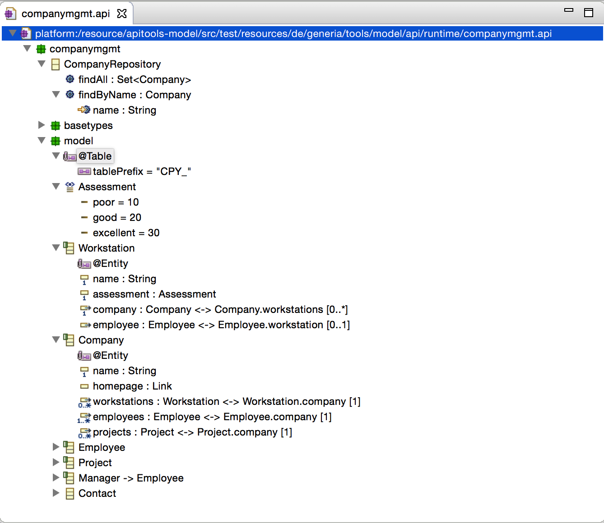

# apitools - editor

A collection of Eclipse plugins that provide 

- an editor for reading, changing and writing "api" descriptions
- UML converter to transform "api" descriptions to UML models
- UML profile builder to create UML profiles used for annotation mappings

## Download

The Eclipse Update Site for the Api Editor is at [http://www.generia.de/tools/model/api/update/](http://www.generia.de/tools/model/api/update/).

## Screenshot

